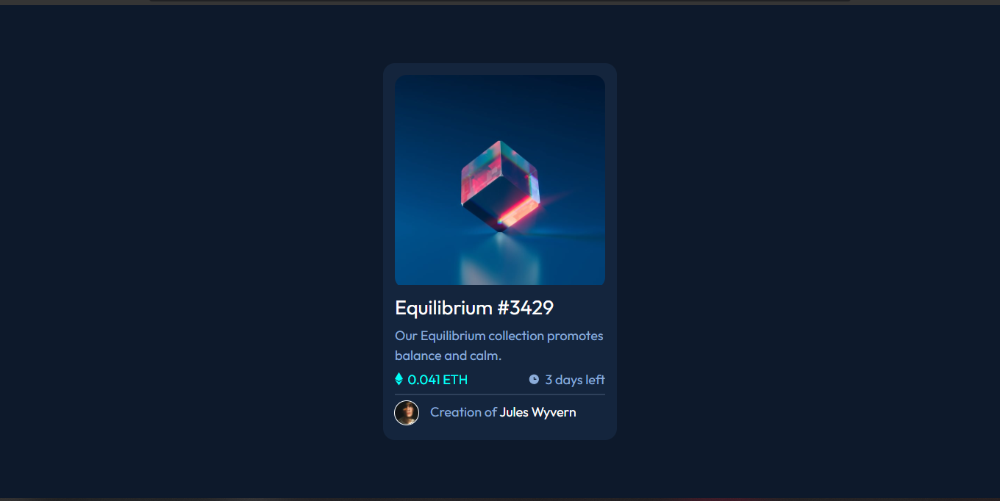
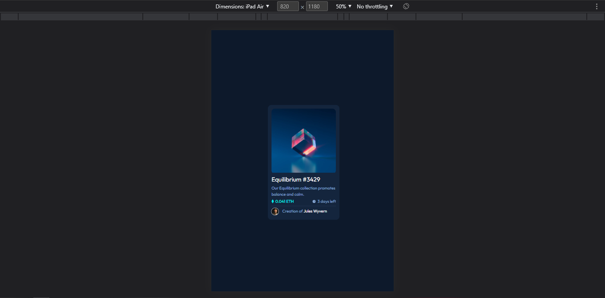
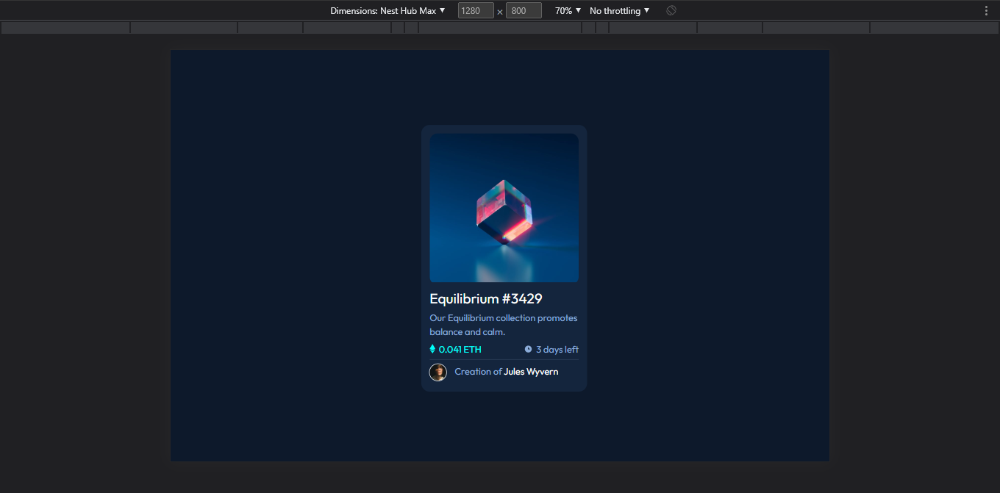
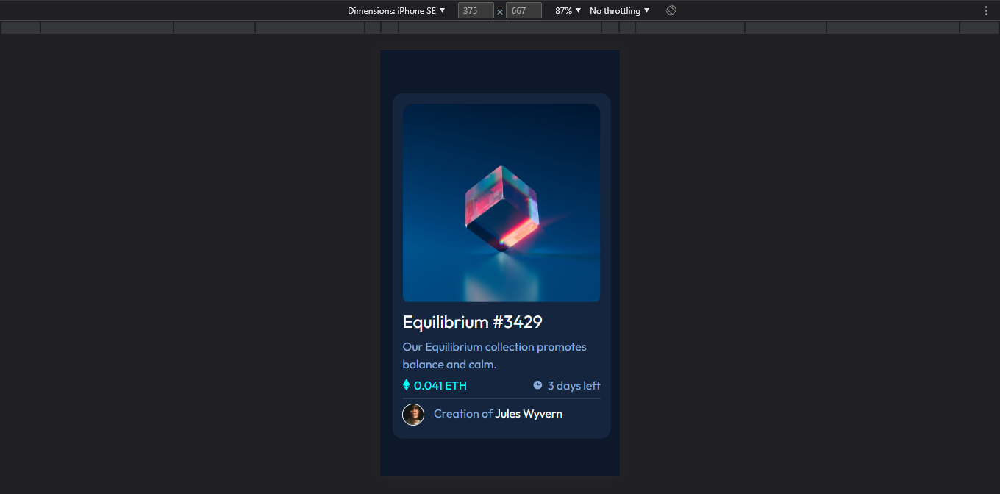
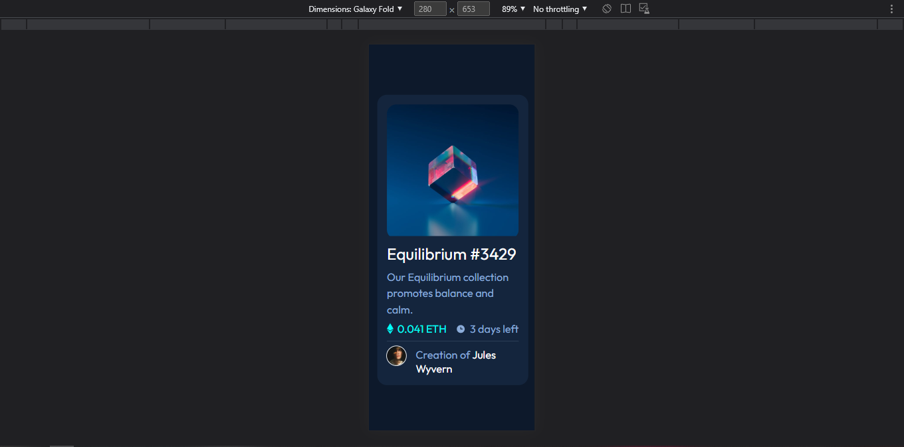

# Frontend Mentor - NFT preview card component solution

This is a solution to the [NFT preview card component challenge on Frontend Mentor](https://www.frontendmentor.io/challenges/nft-preview-card-component-SbdUL_w0U). Frontend Mentor challenges help you improve your coding skills by building realistic projects.

## Table of contents

-   [Overview](#overview)
    -   [The challenge](#the-challenge)
    -   [Screenshot](#screenshot)
    -   [Links](#links)
-   [My process](#my-process)
    -   [Built with](#built-with)
    -   [What I learned](#what-i-learned)
    -   [Continued development](#continued-development)
    -   [Useful resources](#useful-resources)
-   [Author](#author)

## Overview

### The challenge

Users should be able to:

-   View the optimal layout depending on their device's screen size
-   See hover states for interactive elements

### Screenshot

-   desktop
    

-   tablet
    
    

-   mobile
    
    

### Links

-   Solution URL: [Add solution URL here](https://your-solution-url.com)
-   Live Site URL: - Live Site URL: (https://suchaguylikeme-nftpreviewcardcomponent.pages.dev)

## My process

### Built with

-   Semantic HTML5 markup
-   CSS custom properties
-   Flexbox
-   CSS Grid
-   Mobile-first workflow

### What I learned

Use this section to recap over some of your major learnings while working through this project. Writing these out and providing code samples of areas you want to highlight is a great way to reinforce your own knowledge.

To see how you can add code snippets, see below:

```css
.container {
    max-width: 100%;
    width: 19.09375rem; /*305.5px*/
    height: 18.75rem; /*300px*/
    position: relative;
    overflow: hidden;
}

.overlay {
    width: inherit;
    height: inherit;
    position: absolute;
    top: 0;
    opacity: 0;
    background-color: var(--primary-cyan);
    background-image: url(../img/icon-view.svg);
    background-repeat: no-repeat;
    background-position: center;
}
```

If you want more help with writing markdown, we'd recommend checking out [The Markdown Guide](https://www.markdownguide.org/) to learn more.

### Continued development

The use of flexbox, grid, sementic markup and best practices.

### Useful resources

-   (https://www.w3schools.com) - This helped with learning both html and css, but there's various other sites that you could learn it too.

-   (https://www.freecodecamp.org) - This helped searching for specific solutions to my problem at hand. Used freecodecamp in conjunction with w3schools.

## Author

-   Frontend Mentor - [@suchAGuyLikeMe](https://www.frontendmentor.io/profile/suchAGuyLikeMe)
